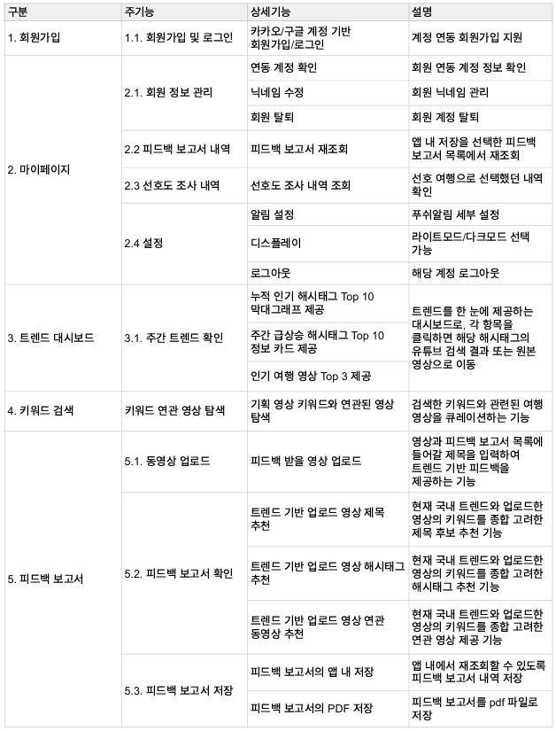
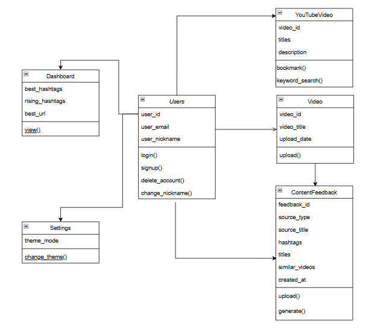
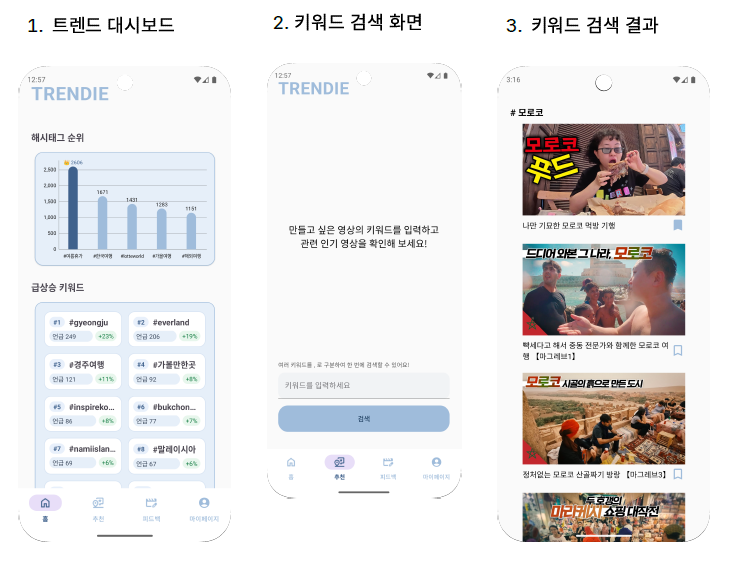
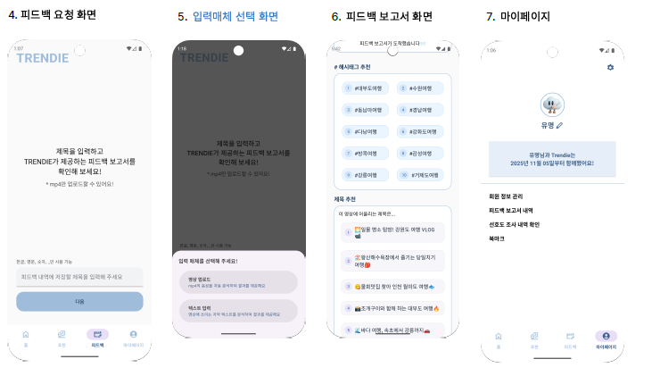
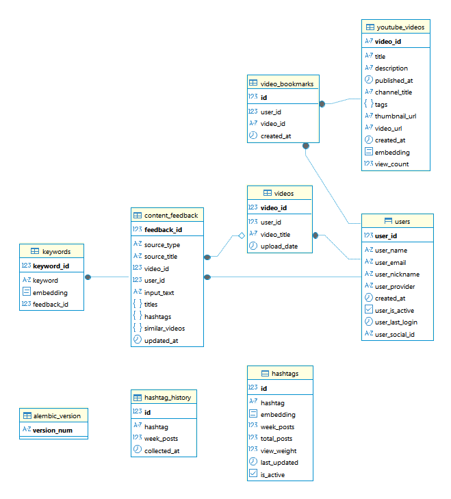
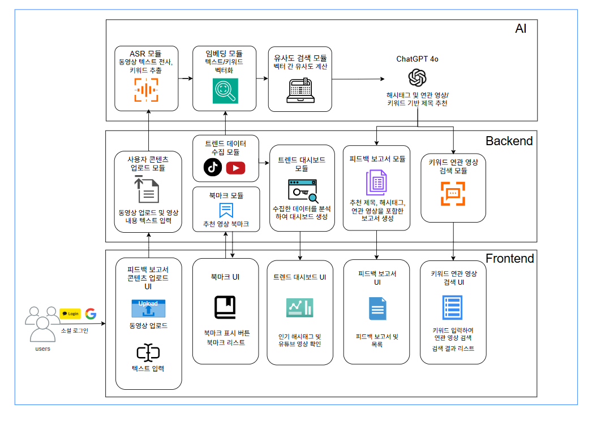

# 2차 보고서

# (1) 팀 정보

## 1.1 과제명 :

### **초보 여행 유튜버를 위한 STT기반 트렌드 반영 맞춤형 가이드 제공 어플리케이션**

## 1.2 팀 정보

### 20팀 스카이화

## 1.3 팀 구성원

| 이름 | 역할 | 담당 업무 |
| --- | --- | --- |
| 윤지운 | BE/AI | - 해시태그 추천 사용자 선호도 집계 <br> - Docker 최적화 및 AWS 서버 운영 관리 <br> - 서비스 초기 테스트 |
| 유화경 | BE/AI | - 영상 추천 알고리즘 개선 <br> - 피드백 AI 도입 및 형식 개선  <br> - AWS 서버 마이그레이션 및 운영 관리 |
| 김하람 | FE | - API 연동 <br> - 디자인 점검 및 UI/UX 보완 <br>- 기능 최종 점검 |

# (2) 과제 요약

## **2.1 문제 정의**

### **1) 프로젝트 배경**

시장조사기관 리서치앤마켓츠에 따르면 글로벌 숏폼 관련 시장규모는 2021년 432억달러(60조원)에서 2026년 1350억달러(187조원)로 성장할 것으로 전망되며, 이는 연평균 25.6%의 높은 증가율을 나타낸다.

콘텐츠 소비 흐름이 짧고 직관적인 영상 중심으로 이동하면서, 많은 여행 유튜버들은 시청자의 시선을 확보하기 위해 트렌드에 맞는 숏폼 영상을 제작한다. 그러나 초보 유튜버들은 빠르게 변화하는 트렌드를 파악하고, 이를 기반으로 한 차별화된 콘텐츠 전략을 수립하는 데 어려움을 겪고 있다.

### **2) Target Customer & Pain Points**

본 과제의 Target Customer은 **한국인 초보 여행 유튜버**이다. 이들은 유튜브 및 틱톡 등 플랫폼에서 구독자와 영상 조회수 상승을 목표로 하고 있지만:

- 인기 여행 영상 및 여행 트렌드 파악이 어렵고,
- 유입률이 높은 해시태그 선정에 한계가 있으며,
- 조회수를 높일 수 있는 영상 제목 작성이 쉽지 않고,
- 제작한 콘텐츠가 최신 트렌드와 얼마나 부합하는지 판단하기 어렵다.

따라서 초보 여행 유튜버들이 트렌드 분석과 콘텐츠 최적화를 효율적으로 수행할 수 있는 지원 툴이 필요하다.

## **2.2 기존 연구와의 비교**

| 비교항목\서비스명 | VidIQ | NIZ | Trendie |
| --- | --- | --- | --- |
| 한국어 지원 | X | O | O |
| 타겟 분야 | 유튜버 | 마케터 | 유튜버 |
| 특정 분야 최적화 | X | X | O |
| 사용자 맞춤형 여부 | O | △ | O |

### **1) VidIQ**

(1) 운영 방식

유튜버들이 채널을 확장하고 더 많은 시청자를 유치하며, 검색 결과에서 더 높은 순위를 차지할 수 있도록 지원하는 YouTube 최적화 도구이다.

(2) 장점

- 경쟁자들의 콘텐츠와 전략 분석 가능
- 동영상에 가장 적합한 키워드와 태그 확인 가능
- 실제 퍼포먼스를 트래킹하여 사용자의 콘텐츠가 눈에 잘 띄도록 지원

(3) 단점

- 한국어 지원 X; 영어, 러시아어, 스페인어, 포르투갈어만 지원
- 트렌드 키워드와 영상 또한 외국어 중심 제공
- 한국어로 검색 시, 검색한 키워드와 전혀 관련 없는 영상이 제공됨
- 높은 비용 (월 17~ 19달러)

**(4) Trendie의 장점**

VidIQ는 인기 동영상이나 트렌드 키워드가 외국어로만 제공되어, 한국인 여행 유튜버는 사용이 어려운 단점이 있다. 

반면, Trendie는 국내 트렌드에 최적화되어, 한국의 주간 인기 해시태그 10개와 인기 영상 3개를 제공함으로써, 한국인 여행 유튜버가 바로 적용할 수 있는 실용적 정보를 제공한다.

### **2) NIZ (니즈)**

(1) 운영방식

고객 반응 분석과 마케팅에 필요한 정보를 제공하는 서비스로, 대시보드를 통해 트렌드 키워드, 요즘 뜨는 데이터, 요즘 뜨는 해시태그를 확인할 수 있다.

(2) 장점

- 한국어 지원 트렌드 분석 서비스
- 사용자가 설정한 키워드 그룹에서 고객들의 감정적 반응을 주간 별로 확인 가능

(3) 단점

- 마케팅 서비스 중심으로, 유튜버가 자신의 영상 피드백을 받기에는 적절하지 않음.
- 특정 분야 최적화 서비스가 아님.

**(4) Trendie의 장점**

NIZ는 마케팅 중심 서비스로, 여러 플랫폼 간의 차이를 비교·분석하고 단순히 사용량이 높은 데이터와 해시태그를 추천하는 데 초점이 맞춰져 있다. 

반면 Trendie는 사용자가 업로드할 유튜브 영상을 직접 분석하여, 영상에 적합한 제목, 해시태그, 참고 영상을 개인 맞춤형으로 추천한다. 이를 통해 사용자는 자신의 콘텐츠에 최적화된 전략을 바로 적용할 수 있다.

## **2.3 제안 내용**

본 프로젝트는 여행 숏폼 콘텐츠를 만들어 구독자와 조회수 상승을 목표로 하나, 빠르게 변화하는 트렌드로 인해 콘텐츠 제작에 어려움을 겪는 사용자의 문제를 해결하고자 한다. 이를 위해 우리는 STT 기반 실시간 여행 트렌드 분석 및 컨텐츠 맞춤형 가이드 어플리케이션이라는 새로운 형식의 서비스를 제안한다. 다음은 문제 정의에 기반한 구체적인 해결책이다.

1. 주간 트렌드 대시보드 제공
- 사용자는 로그인 후 홈화면에서 여행 트렌드 대시보드를 제공한다.
- 트렌드 대시보드에서는 주간 급상승 해시태그 Top 10, 누적 인기 해시태그 Top 10, 인기 영상 Top 3를 확인할 수 있다.
2. 사용자 영상 분석 피드백 보고서 제공
- 유튜브에 업로드 할 예정인 영상이나 영상에 쓰이는 자막 텍스트를 Trendie에 업로드하면 사용자 최적화 피드백 보고서를 제공한다.
- 피드백 보고서에서는 영상 키워드를 기반으로 어울리는 제목, 인기 해시태그, 그리고 유사한 관련 동영상을 추천한다.
3. 키워드 검색 기능
- 사용자가 직접 입력한 키워드를 기반으로 연관 여행 영상을 추천한다.
- 각 결과는 제목, 비디오 url , 썸네일 url, 업로드 날짜, 유사도 점수를 포함한다.

## 2.4 기대효과 및 의의

### 1) 한국인 사용자 맞춤형 서비스

조사 결과 한국 시장에 최적화된, 한국어 중심의, 한국의 여행 트렌드를 분석하는 서비스는 기존에 나와 있지 않았다. 또한 사용자에게 즉각 트렌드를 반영한 피드백을 주는 서비스가 미비했다. 본 프로젝트에서는 한국인 여행 유튜버를 타겟으로 한정하고, 사용자 맞춤형 피드백을 결합해 기존 유사 서비스로 충족할 수 없었던 세밀한 사용자 요구를 해결한다.

### 2) 초보 유튜버의 진입 장벽 완화

유튜브를 처음 시작하는 크리에이터는 시청자 유입을 높이기 위한 키워드 설정에 어려움을 겪을 수 있다. 특히 어떤 스타일의 제목과 해시태그를 사용하는 게 유입률을 높일 수 있을지 갈피를 잡기 어려울 수 있다. 트렌드를 분석하고 사용자의 영상에 적용하는 일을 대신 처리해줌으로써 유튜버가 영상 제작 자체에 더 신경쓸 수 있도록 돕는다.

### 3) 맥락 기반 AI 피드백으로 품질·속도 향상

무관한 해시태그의 남발은 알고리즘 신뢰도를 하락시킨다. STT＋키워드 추출＋OpenAI를 결합하여 사용자가 업로드한 영상 맥락에 적합한 제목과 해시태그, 유사 영상을 추천하여 인기 해시태그만을 추천하던 기존의 한계를 보완하고, 제작 효율과 콘텐츠의 품질을 향상한다.

## 2.5 주요 기능 리스트



### 주요 기능―트렌디의 솔루션

### 1) 트렌드 대시보드 기능

**(1) 사용 기술**

- 트렌드 수집(Playwright, YouTube api)

**(2) 기능 설명**

- 제안 1: 주간 트렌드 대시보드 제공에 대응하는 기능으로, 빠르게 변화하는 트렌드로 인해 콘텐츠 제작에 어려움을 겪는 사용자의 트렌드 파악을 수월하게 돕는다.
- 주간 인기/급상승 해시태그(각 10개씩)와 인기 여행 영상의 썸네일(3개)을 한 화면에 제공한다.
- 해시태그 및 영상 카드를 클릭하면 해당 해시태그의 유튜브 검색 결과 화면 또는 원본 영상 유튜브로 이동한다.

### 2) 피드백 보고서 기능

**(1) 사용 기술**

- FFmpeg 기반 오디오 추출/분할
- OpenAI Whisper(PyTorch)를 이용한 ASR 전사
- OpenAI 프롬프트 기반 제목 추천
- OpenAI ‘text-embedding-3-small’ model  + Cosine Similarity (해시태그 및 유사 영상 추천)
- Android PdfDocument/MediaStore로 PDF 저장 제공

**(2) 기능 설명**

- 제안 2: 사용자 영상 분석 피드백 보고서 제공에 대응하는 기능으로, 실시간 여행 트렌드 분석 STT 기반 및 컨텐츠 맞춤형 가이드를 제시함으로써 사용자 최적화 피드백을 제공한다.
- 사용자가 업로드한 영상에서 음성을 인식(STT)하거나, 음성이 없거나 잡음이 심한 영상의 경우 자막 텍스트를 직접 입력받아 주요 키워드를 추출한다.
- 추출된 키워드를 바탕으로 현 트렌드를 반영한 제목과 해시태그를 추천하고 연관 영상을 제공한다. 각각 하단에 기술된 세부 기능: 제목 추천 기능, 해시태그 추천 기능, 연관 유튜브 영상 추천 기능에 해당한다.
- 보고서의 앱 내 내역 보관/PDF 저장이 가능하다.

### 2-1) 제목 추천 기능

**(1) 사용 기술**

- OpenAI

**(2) 기능 설명**

- OpenAI GPT 모델을 활용해 추출한 키워드 기반 15 ~ 30자 이내, 클릭률 높은 숏폼 제목 후보를 3~5개 생성한다.

### 2-2) 해시태그 추천 기능

**(1) 사용 기술**

- 해시태그 임베딩 DB (사전 구축된 해시태그 + 임베딩)
- OpenAI ‘text-embedding-3-small’ Embedding model + Cosine Similarity

**(2) 기능 설명**

- 영상 키워드 임베딩과 DB 내 해시태그 임베딩의 코사인 유사도를 계산하여, 의미적으로 가까운 해시태그를 추천한다.

### 2-3) 연관 유튜브 영상 추천 기능

**(1) 사용 기술**

- 영상에서 추출한 키워드와 YouTube 영상 DB의 임베딩 벡터를 비교해 유사도를 측정, 관련도 높은 영상을 추천한다.
- Android 썸네일 로딩: Coil

**(2) 기능 설명**

- 사용자의 영상과 주제가 유사한 YouTube 영상 3개를 카드 형태로 큐레이션하고, 클릭 시 원본 영상으로 이동한다.

### 3) 키워드 검색 기능

**(1) 사용 기술**

- OpenAI ‘text-embedding-3-small’ Embedding model
- 코사인 유사

**(2) 기능 설명**

- 제안 3: 키워드 검색 기능에 대응하는 기능으로, 트렌드의 빠른 변화로 콘텐츠 제작에 어려움을 겪는 사용자의 탐색을 편리화하여 노력과 시간이 분산되지 않고 영상에 오롯이 집중될 수 있도록 한다.
- 사용자가 입력한 키워드를 OpenAI 임베딩으로 벡터화하여 DB 내 영상 임베딩과 코사인 유사도를 계산하고, 관련도가 높은 여행 영상을 추천하여 영상 기획 단계 초기 탐색을 지원한다.

# (3) 과제 설계

## 3.1 요구사항 정의

### 1) 기능별 상세 요구사항

| **요구사항 ID** | **요구사항명** | **기능 ID** | **기능명** | **상세 설명** | **필수 데이터** | **선택 데이터** | **진척도** |
| --- | --- | --- | --- | --- | --- | --- | --- |
| MEM01 | 로그인 | MEM01_LOGIN01 | 소셜 로그인 기능 | 사용자가 Google, Kakao 계정을 통해 OAuth2 인증 수행. 평균 로그인 응답 2초, 성공률 99% 이상. 액세스 토큰 30분, 리프레시 토큰 1주 | 카카오/구글 인가 코드 | - | 100% |
| MEM02 | 회원가입 | MEM02_SIGNUP01 | 회원가입 기능 | 신규 사용자가 소셜 계정 최초 로그인 시 닉네임 입력 후 가입. 입력 검증 후 DB 저장, 응답 평균 5초, 성공률 99.9% | 소셜 ID, 이메일, 닉네임 | - | 100% |
| MEM03 | 회원 탈퇴 | MEM03_DELETE01 | 회원 탈퇴 기능 | 사용자가 탈퇴 요청 시 DB/Redis 내 모든 사용자 관련 데이터 삭제. 삭제 평균 5초, 성공률 100% | Authorization (Bearer 액세스 토큰) | - | 100% |
| MEM04 | 로그아웃 | MEM04_LOGOUT01 | 로그아웃 기능 | JWT 토큰 및 Redis 저장 소셜 액세스 토큰 삭제 | Authorization (Bearer 액세스 토큰) | - | 100% |
| MAIN01 | 업로드 | MAIN01_UPLOADVIDEO01 | 비디오 업로드 기능 | 최대 100MB MP4 영상 업로드. 업로드 응답 60초 이내, 메타데이터 DB 기록 1초 이내, 성공률 99.9% | 영상 파일, 제목 | - | 100% |
| MAIN01 | 업로드 | MAIN01_UPLOADTEXT01 | 자막 텍스트 업로드 기능 | 최대 10,000자 텍스트 입력. 업로드 응답 60초 이내 | 입력 텍스트, 제목 | - | 100% |
| MAIN02 | 영상 피드백 보고서 | MAIN02_TITLE01 | 영상 제목 추천 기능 | 업로드된 영상 분석 후 OpenAI 기반으로 제목 추천. 최소 3개, 최대 5개, 적합도 80% 이상, 생성 10초 이내 | 영상 ID | - | 70% |
| MAIN02 | 영상 피드백 보고서 | MAIN02_HASHTAG01 | 해시태그 추천 기능 | 영상 키워드 기반 해시태그 추천. 최소 5개, 최대 10개, 적합도 75% 이상, 생성 10초 이내 | 영상 ID | - | 70% |
| MAIN02 | 영상 피드백 보고서 | MAIN02_RELATED01 | 연관 여행 영상 추천 기능 | 영상 키워드 임베딩과 DB 영상 임베딩 유사도 비교 후 관련 영상 추천. 기본 5개 추천, 생성 10초 이내 | 영상 ID | - | 70% |
| MAIN03 | 트렌드 대시보드 | MAIN03_WEEKTAG01 | 주간 급상승 해시태그 제공 | 최근 2회 수집 데이터를 비교하여 상승세 해시태그 제공, 최대 10개, 조회 3초 이내 | - | - | 80% |
| MAIN03 | 트렌드 대시보드 | MAIN03_TAG01 | 누적 인기 해시태그 제공 | 집계된 데이터에서 가장 많이 사용된 여행 해시태그 TOP 10 제공. 데이터 주 단위 갱신, 조회 응답 2초, 집계 정확도 99% 이상 | - | - | 80% |
| MAIN03 | 트렌드 대시보드 | MAIN03_VIDEO01 | 인기 여행 영상 확인 기능 | 조회수 기준 상위 3개 영상 선정 후 썸네일 반환, 404 시 오류 반환, 응답 2초 이내 | - | 정렬 기준(조회수) | 80% |
| MAIN04 | 키워드 기반 연관 영상 검색 | MAIN04_SEARCH01 | 키워드 기반 영상 추천 | 사용자가 입력한 키워드 기반으로 YouTube DB에서 연관 여행 영상 추천. 최대 10개, 제목/URL/썸네일/업로드일/유사도 포함, 응답 3초 | 키워드 | - | 80% |
| MARK01 | 북마크 | MARK01_SAVE01 | 북마크 생성 | 사용자가 선택한 영상을 북마크로 저장. 사용자 ID와 영상 ID를 기반으로 DB에 북마크 레코드 추가. 응답 시간 1초 이내. | video_id, user_id |  | 100% |
| MARK01 | 북마크 | MARK01_DELETE01 | 북마크 삭제 | 사용자가 등록한 북마크를 해제. DB에서 해당 user_id와 video_id 매핑 데이터 삭제. 응답 시간 1초 이내. | video_id, user_id |  | 100% |
| MARK01 | 북마크 | MARK01_SHOW01 | 북마크 조회 | 사용자가 저장한 북마크 리스트 조회. 영상 제목·썸네일·URL·업로드일 포함, 최대 20개 반환, 응답 시간 2초 이내. | user_id |  | 90% |
| WEB01 | 웹 보안 | WEB01_SECURITY01 | 웹 보안 강화 | HTTPS, SSL 사용, TLS 1.2 이상 지원, ACM 인증서 적용, ALB와 연동 | - | - | 90% |
| WEB02 | 웹 호스팅 | WEB02_HOSTING01 | 웹 호스팅 | AWS EC2 t3.small 인스턴스, Amazon Linux 2023, VPC/서브넷 구성, ALB 연동, 보안 그룹 설정 | - | - | 90% |
| WEB03 | 도메인 | WEB03_DOMAIN01 | 도메인 발급 | 가비아 도메인을 웹 서버(ALB, EC2)에 연결, SSL/TLS 인증서 적용 | - | - | 100% |
| SET01 | 설정페이지 | SET01_THEME01 | 다크/라이트 모드 전환 기능 | UI 테마 전환 가능 | Authorization (Bearer 액세스 토큰), 테마 선택 | - | 100% |

### 2) 클래스 다이어그램



### 3) UI 분석/설계 모델



**(1) 화면 흐름 (Flow)**

1. 사용자가 홈 화면에 접속한다.
2. 홈 화면에서 **트렌드 대시보드(1)** 를 통해 
    - 누적 인기 키워드
    - 급상승 키워드
    - 인기 여행 유튜브 영상
        
        을 확인한다.
        
3. 사용자는 기획하고자 하는 유튜브 여행 영상 키워드를 입력하여 **키워드 검색(2)** 기능을 활용한다.
4. **키워드 검색 결과 화면(3)** 에 표시된 연관 유튜브 여행 영상 목록을 확인하고 영상 기획에 참고한다.

**(2) 화면 구성 (UI Layout)**

- **홈 화면(1)**
    - 트렌드 대시보드
        - 누적 인기 해시태그
        - 급상승 해시태그
        - 인기 여행 유튜브 영상 썸네일
    - 네비게이션 바
        - 홈, 추천(키워드 검색), 피드백, 마이페이지 버튼
- **키워드 검색 화면(2)**
    - 키워드 입력 안내 문구
    - 입력 창 및 검색 버튼 (하단 고정, 접근성 강화)
    



**(1) 화면 흐름 (Flow)**

1. 사용자가 피드백 보고서 화면(4)에 접속한다.
2. 사용자는 피드백 보고서 제목을 작성하고, ‘다음’ 버튼을 누르면 사용자는 입력 매체를 선택하게 된다.(5)
    
    사용자는 제작한 여행 영상을 업로드하거나 영상에 쓰이는 자막 텍스트를 입력할 수 있다.
    
- 업로드 가능한 파일 형식은 MP4이며, 이에 대한 안내 문구가 화면에 표시된다.
1. 영상 업로드가 완료되면, 피드백 보고서 화면(6)이 제공된다. 
    - 업로드된 영상을 기반으로 해시태그, 제목, 참고 영상이 자동으로 추천된다.
2. 생성된 피드백 보고서 내역은 마이페이지(7)의 피드백 보고서 내역에서 확인할 수 있다.

**(2) 화면 구성 (UI Layout)**

- **피드백 요청 화면(4)**
    - 피드백 보고서 관련 안내 문구
    - 피드백 보고서 제목 입력창
- **입력 매체 선택 화면(5)**
    - 영상 업로드 선택 버튼 (MP4 전용)
    - 자막 텍스트 입력 선택 버튼
- **피드백 보고서 화면(6)**
    - 해시태그 추천 리스트
    - 제목 추천 리스트
    - 참고 유튜브 여행 영상 추천 리스트
- **마이페이지(7)**
    - 회원 정보 관리 버튼
    - 피드백 보고서 내역 확인 버튼

### 4) E-R 다이어그램



1. **users** : 사용자 계정 및 프로필 관리
2. **videos** : 사용자 업로드 영상 관리
3. **keywords** : 영상별 키워드 저장, OpenAI 기반 제목 생성 및 임베딩 활용(연관 해시태그 추천)
4. **content_feedback** : 영상이나 자막 텍스트에 대한 AI 피드백 (추천 제목, 해시태그, 유사 영상)
5. **hashtag_history** : 틱톡 여행 관련 해시태그 사용량 주차별 변화 기록
6. **hashtags** : 틱톡 여행 관련 해시태그 최신 상태 및 분석 정보
7. **youtube_videos** : YouTube API로 수집된 여행 영상 데이터
    - 피드백 보고서에서 유사 여행 영상 추천
    - 트렌드 대시보드에서 인기 여행 영상 데이터 제공
8. **video_bookmarks**: 사용자의 관심 유튜브 영상 북마크 관리

## 3.2 전체 시스템 구성



1. 트렌드 대시보드
TikTok Creative Center와 Youtube에서 트렌드 관련 데이터를 수집하고 분석한다. 이 데이터를 기반으로 주간 인기/급상승 해시태그와 인기 여행 영상의 썸네일을 포함한 트렌드 대시보드를 제공한다.
2. 피드백 보고서
영상과 텍스트 중 선택하여 피드백 받을 콘텐츠를 업로드할 수 있다. 업로드된 영상의 음성은 텍스트로 변환된다. 업로드된 콘텐츠의 키워드 추출 후 벡터화, 코사인 유사도를 계산하여 영상과 관련된 해시태그와 유사 유튜브 영상과 키워드 기반 클릭률 높은 숏폼 제목 후보를 생성한다. 이 내용을 포함한 피드백 보고서를 제공한다.
3. 키워드 검색
사용자가 입력한 키워드를 임베딩하여 벡터화하고, DB에 저장된 유튜브 데이터와 코사인 유사도를 계산하여 연관 유튜브 영상을 제공한다. 클릭 시 원본 영상으로 이동한다.

## 3.3 주요 엔진 및 기능 설계

### 3.3.1 데이터 수집 기능 설계

### 1) 설계 개요

후술하는 모든 기능들과 모듈을 사용하기 위해 틱톡과 유튜브에서 데이터를 수집해 Trendie의 DB에 저장한다.

### 2) 주요 구성 모듈 및 기술

| 모듈 | 역할 | 사용 기술 |
| --- | --- | --- |
| **틱톡 크롤링 모듈** | 해시태그의 주간 사용량을 주간 단위로 크롤링 | Playwright |
| **유튜브 Data API 모듈** | YouTube Data API를 통해 여행 관련 영상을 수집하고, 텍스트 분석·임베딩 생성·DB 저장을 수행함 | YouTube Data API v3, OpenAI Embedding API, SQLAlchemy |

### 3) 구현 방식

**(1) 틱톡 크롤링 모듈**

Tiktok Creative Center에서  지난 일주일간 가장 많이 사용된 Travel과 연관된 해시태그들을 크롤링한다.

[https://ads.tiktok.com/business/creativecenter/inspiration/popular/hashtag/pc/en](https://ads.tiktok.com/business/creativecenter/inspiration/popular/hashtag/pc/en)

```jsx
def scrape_travel_hashtags_fixed():
    with sync_playwright() as p:
        browser = p.chromium.launch(headless=False)
        ctx = browser.new_context(storage_state=COOKIES_FILE)
        page = ctx.new_page()
        page.goto(HASHTAG_URL, wait_until="networkidle")
        time.sleep(1)

        btn = page.query_selector("button:has-text('Industry')") \
            or page.query_selector("span:has-text('Industry')")
        if btn:
            btn.click()
            time.sleep(1)
        for _ in range(15):
            t = page.query_selector("li:has-text('Travel')") \
                or page.query_selector("span:has-text('Travel')") \
                or page.query_selector("div:has-text('Travel')")
            if t and t.is_visible():
                t.scroll_into_view_if_needed()
                t.click()
                break
            #page.keyboard.press("ArrowDown")
            page.evaluate("""
                    const scrollBox = document.querySelector('div.industryItems');
                    if (scrollBox) scrollBox.scrollTop += 60;
                """)
            time.sleep(0.2)
        time.sleep(2)

        for _ in range(20):
            page.mouse.wheel(0, 2150)
            time.sleep(1)
        time.sleep(1)

        # ✅ 스크린샷 저장
        page.screenshot(path="debug_tiktok_page.png", full_page=True)
        print("📸 페이지 스크린샷 저장됨: debug_tiktok_page.png")

        lines = [l.strip() for l in page.inner_text("body").splitlines() if l.strip()]
        browser.close()

    results = []
    i = 0
    found_first = False
    while i < len(lines) - 4:
        if not found_first:
            if (
                re.match(r"^\d+$", lines[i])
                and lines[i + 1].startswith("#")
                and lines[i + 2] == "Travel"
                and re.match(r"^[0-9,.]+[KMB]?$", lines[i + 3])
                and lines[i + 4] == "Posts"
            ):
                results.append((lines[i + 1], lines[i + 3]))
                found_first = True

                i += 5

                while i < len(lines) and (
                    lines[i] in [
                        "See analytics",
                        "Access detail page for more insights of the trend",
                        "Got it"
                    ]
                ):
                    i += 1
                continue
            else:
                i += 1
                continue

        if (
                re.match(r"^\d+$", lines[i])
                and lines[i + 1].startswith("#")
                and lines[i + 2] == "Travel"
                and re.match(r"^[0-9,.]+[KMB]?$", lines[i + 3])
                and lines[i + 4] == "Posts"
        ):
            results.append((lines[i + 1], lines[i + 3]))
            i += 5
        else:
            i += 1

    return results
```

서버 과부하를 방지하기 위해 로컬 환경에서 실행한 후 API를 통해 서버 DB로 전송한다.

```jsx
def send_hashtags_to_api(hashtags):
    for tag, post_count in hashtags:
        try:
            week_posts= int(
                post_count
                    .replace(",","")
                    .replace("K","000")
                    .replace("M", "000000")
                    .replace("B", "000000000")
            )
        except ValueError:
            print(f"❌ 숫자 변환 실패: {post_count}")
            continue

        data = {
            "hashtag": tag.lstrip("#"),
            "week_posts": week_posts
        }

        try:
            response= requests.post(API_URL, json=data)
            response.raise_for_status()
            print(f"✅ {data['hashtag']} 전송 성공")
        except requests.RequestException as e:
            print(f"❌ {data['hashtag']} 전송 실패: {e}")
```

**(2) 유튜브 Data API 모듈**

1. 스케줄러 기반 데이터 수집

```python
@router.post("/crawl", summary="유튜브에서 여행 영상을 데이터 불러와 DB에 저장")
def crawl_youtube(keyword: str = "여행", db: Session = Depends(get_db)):
    """유튜브에서 여행 영상 수집 및 DB 저장"""
    try:
        count = crawl_and_store(keyword, db)
        return {"message": f"{count}개의 여행 영상이 저장되었습니다."}
    except Exception as e:
        import traceback
        traceback.print_exc()
        raise e
```

/crawl 엔드포인트는 주간 단위로 스케줄러에 의해 호출되며, YouTube Data API v3를 이용해 여행 관련 영상을 자동 수집한다.

1. 여행 관련성 판별

```python
def is_travel_video(text, threshold=0.3):
    """여행 영상 여부 판별"""
    video_embedding = get_embedding(text)
    max_score = max(
        cosine_similarity(video_embedding, ref)
        for ref in reference_embeddings
    )
    return max_score >= threshold, max_score
```

영상 텍스트를 입력으로 받아 OpenAI Embedding API를 통해 임베딩 벡터를 생성한다. 사전에 정의된 여행 관련 기준 문장과의 코사인 유사도를 계산하여 일정 임계값(0.3) 이상인 경우에만 여행 관련 영상으로 분류한다. 이 과정은 간단한 규칙 기반 필터링이 아닌 의미 기반 판별 구조로, 향후에는 학습 데이터셋 기반 분류 모델로 대체될 예정이다.

### 4) 개선 및 향후 보완사항

현재 수집된 해시태그들은 여름(8월)부터 수집되었기 때문에 비교적 여름과 관련된 해시태그가 겨울에도 상위권에 위치해있다. 따라서 이를 보완하기 위해 내년까지 최소 1년간 해시태그 데이터를 크롤링할 예정이다.

유튜브 data api 모듈은 현재는 기준 문장 집합에 기반해 의미 유사도를 계산하지만, 향후에는 수집 데이터셋을 이용한 지도학습 모델을 학습시켜 주제별 분류 정확도를 향상시킬 계획이다.

### 3.3.2 트렌드 대시보드 기능 설계

### **1) 설계 개요**

트렌드 대시보드는 해시태그 사용량과 영상 조회수 데이터를 분석하여 최근 트렌드의 변화 및 인기 콘텐츠를 분석하여 시각적으로 제공하기 위해 설계되었다.

해시태그의 주간 변화량을 비교하여 가장 많이 사용된 해시태그, 전주 대비 급상승한 해시태그와 조회수 기준 상위 영상을 함께 제공한다.

시스템은 요청을 처리하는 트렌드 API 모듈, 해시태그 데이터를 비교·분석하는 해시태그 분석 모듈, 조회수 기준 콘텐츠를 조회하는 인기 영상 모듈, 그리고 결과를 반환하는 응답 처리 모듈로 구성된다.

### **2) 주요 구성 모듈 및 기술**

| 모듈 | 역할 설명 | 사용 기술 |
| --- | --- | --- |
| **인기 해시태그 모듈** | Hashtag 테이블에서 누적 게시물 수 기준으로 상위 해시태그를 추출 | SQLAlchemy |
| **상승 해시태그 모듈** | HashtagHistory 데이터를 비교하여 주간 증가율 계산 | SQLAlchemy |
| **인기 영상 모듈** | 조회수 기준 상위 3개 영상의 썸네일 URL 반환 | SQLAlchemy, PostgreSQL |

### **3) 구현 방식**

**(1) 인기 해시태그 모듈**

```python
def get_best_hashtags(db: Session, top_n: int = 10):
    hashtags = (
        db.query(Hashtag)
        .filter(Hashtag.total_posts != None)
        .filter(Hashtag.is_active == True)
        .order_by(Hashtag.total_posts.desc())
        .limit(top_n)
        .all()
    )
    return [
        {
            "hashtag": h.hashtag,
            "total_posts": h.total_posts,
        }
        for h in hashtags
    ]
```

인기 해시태그 모듈은 Hashtag 테이블에서 누적 게시물 수 기준으로 상위 10개의 해시태그를 조회한다. 활성화된 해시태그만 필터링하며, 해시태그명과 누적 게시물 수를 반환한다.

**(2) 급상승 해시태그 모듈**

```python
def get_rising_hashtags(db: Session, this_week_date, last_week_date, top_n: int = 10):
    base_query = db.query(HashtagHistory).join(
        Hashtag, Hashtag.hashtag == HashtagHistory.hashtag
    ).filter(Hashtag.is_active == True)

    this_week = base_query.filter(HashtagHistory.collected_at == this_week_date).all()
    last_week = base_query.filter(HashtagHistory.collected_at == last_week_date).all()

    last_week_dict = {h.hashtag: h.week_posts for h in last_week}

    rising_list = []
    for h in this_week:
        last_val = last_week_dict.get(h.hashtag, 0)
        diff = h.week_posts - last_val
        growth_rate = round((diff / (last_val + 1)) * 100, 2)
        rising_list.append({
            "hashtag": h.hashtag,
            "this_week": h.week_posts,
            "growth_rate": growth_rate,
        })

    rising_list.sort(key=lambda x: x["growth_rate"], reverse=True)
    return rising_list[:top_n]
```

상승 해시태그 모듈은 최근 두 주의 HashtagHistory 데이터를 비교하여 해시태그별 게시물 증가율을 계산하고, 가장 높은 증가율을 보인 상위 10개 해시태그를 반환한다. 활성화된 해시태그만을 대상으로 분석한다.

**(3) 인기 영상 모듈**

```python
def get_top_videos_by_views(db: Session, limit: int = 3):
    videos = (
        db.query(YouTubeVideo.thumbnail_url)
        .order_by(YouTubeVideo.view_count.desc())
        .limit(limit)
        .all()
    )
    return [v[0] for v in videos if v[0] is not None]
```

인기 영상은 get_top_videos_by_views()를 통해 조회수 기준 상위 3개 영상의 썸네일 URL을 반환한다. 결과가 없을 경우 HTTP 404 예외를 발생시키며, 응답은 PopularVideosResponse 스키마를 통해 JSON 형태로 반환된다.

### **4) 개선 및 향후 보완사항**

현재 인기 영상 모듈은 전체 DB에서 누적 조회수 기준 상위 3개 영상만을 반환하는 구조로, 최근 트렌드나 단기적인 관심도 변화가 반영되지 않는 한계가 있다.
향후에는 트렌드 변화를 보다 정확히 반영하기 위해, 특정 기간(예: 최근 7일) 동안의 조회수 증가율을 기준으로 인기 영상을 선정하는 방식으로 개선함으로써 시간에 따른 관심도 변화를 반영하는 동적 인기 지표를 구성할 필요가 있다.

### 3.3.3. 피드백 보고서 기능 설계

### **1) 설계 개요**

피드백 보고서 기능은 사용자가 업로드한 영상을 분석하여 콘텐츠 개선에 도움이 되는 제목, 해시태그, 연관 영상을 자동으로 추천하는 기능이다.

이를 위해 시스템은 총 다섯 개의 주요 모듈로 구성되어 있으며, 각 모듈은 입력된 데이터를 단계적으로 처리하여 최종 보고서를 생성한다.

### 2) 세부 기능 모듈

| 모듈 | 주요 역할 | 사용 기술 |
| --- | --- | --- |
| **동영상 업로드 / 자막 텍스트 입력 모듈** | 사용자의 영상을 업로드하거나 영상에 쓰이는 자막 텍스트를 입력한다 |  |
| **STT 처리 모듈** | 영상 파일을 입력받아 오디오를 추출(FFmpeg)하고 Whisper 모델을 이용해 음성을 텍스트로 전사(STT) | FFmpeg, OpenAI Whisper(PyTorch) |
| **키워드 추출 모듈** | 전사된 텍스트를 분석해 주요 명사·핵심어를 식별하고, 후속 추천 모듈에 전달 | OpenAI Prompt 기반 문맥 분석 |
| **해시태그 추천 모듈** | 키워드 임베딩과 사전 구축된 해시태그 임베딩 DB 간 코사인 유사도를 계산하여 관련 해시태그 추천 | OpenAI Embedding + Cosine Similarity |
| **제목 추천 모듈** | 추출된 키워드를 기반으로 클릭률이 높은 제목 후보(3~5개)를 생성 | OpenAI GPT Model |
| **연관 영상 추천 모듈** | 영상 키워드 임베딩과 YouTube 영상 DB 임베딩을 비교해 의미적으로 유사한 영상을 추천 | OpenAI Embedding + Cosine Similarity, Coil(Android 이미지 비동기 로딩) |

### 3) 구현 방식

**(1) 동영상 업로드 / 자막 텍스트 입력 모듈**

이 모듈은 피드백 보고서 제목과 함께 동영상 혹은 자막 텍스트를 사용자에게 입력 받는 모듈이다.

```jsx
@router.post("/upload_video/", response_model=Video)
def upload_video(
    file: UploadFile = File(...),
    video_title: str = Form(...),
    db: Session = Depends(deps.get_db),
    current_user: User = Depends(get_current_user),
):
    return handle_video_upload(db, file, video_title, user_id = current_user.user_id)
```

```jsx
@router.post("/process_text_keywords/")
def process_text_keywords(
        request: TextProcessRequest,  # 새로운 텍스트 스키마 사용
        db: Session = Depends(deps.get_db),
        current_user: User = Depends(get_current_user),):
    # video_id 대신 input_text와 text_title을 service 함수에 전달
    try:
        feedback = process_text_for_keywords(
            db=db,
            user_id = current_user.user_id,
            input_text=request.input_text,
            text_title=request.text_title,
        )
        if not feedback:
            raise HTTPException(status_code=500, detail="키워드 분석 결과를 저장하지 못했습니다.")

    except Exception as e:
        # 서비스 레이어에서 발생한 오류 처리
        print(f"텍스트 키워드 처리 중 오류 발생: {e}")
        raise HTTPException(status_code=500, detail=f"텍스트 키워드 처리 중 오류가 발생했습니다: {e}")

    return {
        "message": "텍스트 키워드 처리 완료",
        "feedback_id": feedback.feedback_id
    }

```

**(2) STT 처리 모듈**

이 모듈은 사용자가 업로드한 영상을 입력받아 음성을 텍스트로 변환하는 역할을 수행한다.

```jsx
def save_video_file(file: UploadFile, user_id: int, video_title: str) -> str:
    os.makedirs(UPLOAD_DIR, exist_ok=True) # dir 생성

    filename = f"{user_id}_{video_title}.mp4"
    file_path = os.path.join(UPLOAD_DIR, filename)

    with open(file_path, "wb") as buffer:
        shutil.copyfileobj(file.file, buffer) # UploadFile 내용 로컬에 저장
    return file_path
```

- 영상을 서버의 로컬 디렉토리에 잠시 저장한다.

```jsx
def transcribe_audio(file_path: str, language="Korean", backend="openai") -> str:
    if backend == "openai":
        tmp_out_path = None
        try:
            # 임시 mp3 파일 생성
            with tempfile.NamedTemporaryFile(delete=False, suffix=".mp3") as tmp_out:
                tmp_out_path = tmp_out.name

            # ffmpeg으로 오디오만 추출 (mp3)
            subprocess.run(
                ["ffmpeg", "-i", file_path, "-vn", "-acodec", "libmp3lame", tmp_out_path, "-y"],
                check=True
            )

            # OpenAI Whisper API 호출
            with open(tmp_out_path, "rb") as audio_file:
                transcript = _openai_client.audio.transcriptions.create(
                    model="whisper-1",
                    file=audio_file,
                    response_format="text"
                )
            return transcript
        finally:
            # 임시 파일 삭제
            if tmp_out_path and os.path.exists(tmp_out_path):
                os.remove(tmp_out_path)
    else:
        raise ValueError(f"지원하지 않는 backend: {backend}")
```

- ffmpeg로 입력 파일에서 오디오만 뽑아 **tmp_out_path**에 저장한다.
- OpenAI의 Whisper(PyTorch) 기반 STT 모델**(whisper-1)**을 통해 음성을 전사한다.
- 전사 결과는 문장 단위로 정제되어 키워드 추출 모듈에 전달된다.
- 처리 완료 후 (성공/실패 상관없이) 임시 MP3 파일을 삭제해서 디스크 낭비를 방지한다.

**(3) 키워드 추출 모듈**

이 모듈은 전사된 텍스트를 입력받아 주요 키워드를 도출하는 역할을 수행한다.

```jsx
def extract_keywords(text: str) -> str:
    prompt = f"""
당신은 콘텐츠 마케팅 전문가입니다.

다음 한국어 텍스트 내용을 기반으로, 여행 유튜브 영상 설명란에 넣을 수 있는 **해시태그**들을 생성해주세요.
- 각 해시태그는 1~3단어로 구성해주세요.
- "#"을 붙인 형식으로 리스트 형태로 반환해주세요.
- 너무 일반적인 단어 대신 이 영상의 주제와 관련된 구체적인 키워드를 사용해주세요.
- 한국인 여행 유튜버를 위한 서비스임을 고려해주세요.
- 한국어 텍스트 내용을 기반으로 한국 국내 여행이면 해시태그에 '(해당지역)+여행'이라는 키워드는 필수로 포함해주세요.
- 한국어 텍스트 내용을 기반으로 한국이 아닌 해외 여행이면 해시태그에 '(해당나라)+여행'과 '(해당도시)+여행'이라는 키워드는 필수로 포함해주세요.
- 만약 키워드를 리스트 형태로 반환하다가 중간에 응답 길이 제한에 걸리면, 해당 (#키워드)는 삭제하고 출력해주세요.

텍스트:
\"\"\"{text}\"\"\"
"""
    response = client.chat.completions.create(
        model="gpt-4",
        messages=[{"role": "user", "content": prompt}],
        temperature=0.4,
        max_tokens=200
    )
    return response.choices[0].message.content.strip()
```

- OpenAI 프롬프트 기반의 자연어 분석을 통해 문맥적으로 대표성이 높은 단어를 식별하며, 이 키워드는 이후 제목 및 해시태그 추천 모듈의 핵심 입력으로 사용된다.

```jsx
def parse_keywords(text: str) -> list[str]:
    return [tag.strip() for tag in re.findall(r"#([^\s#\"'\[\],]+)", text)]
```

- 해시태그가 포함된 문자열에서 해시태그를 추출한다.

**(4) 해시태그 추천 모듈**

이 모듈은 키워드 임베딩을 기반으로 의미적으로 유사한 해시태그를 계산한다.

```jsx
def recommend_hashtags_from_keywords(db: Session, feedback_id: int, top_n: int = 10) -> List[str]:
    # 1. feedback_id로 keyword + embedding 가져오기
    db_keywords = get_keywords_with_embeddings_by_feedback_id(db, feedback_id)
    if not db_keywords:
        return []

    # 2. DB에서 모든 hashtag embedding 가져오기
    hashtags = db.query(Hashtag).filter(
        Hashtag.embedding != None,
        Hashtag.is_active == True
    ).all()
    if not hashtags:
        return []

    # 3. 각 keyword별로 점수 계산 후 합산
    hashtag_scores = {h.hashtag: 0.0 for h in hashtags}
    for kw in db_keywords:
        for h in hashtags:
            sim = cosine_similarity(kw.embedding, h.embedding)
            hashtag_scores[h.hashtag] += sim  # 점수 합산

    scored_hashtags = sorted(hashtag_scores.items(), key=lambda x: x[1], reverse=True)

    # 4. 정렬 후 top_n 반환
    scored_hashtags.sort(key=lambda x: x[1], reverse=True)
    return [h for h, _ in scored_hashtags[:top_n]]
```

- OpenAI text-embedding-3-small 모델을 이용해 각 키워드를 벡터로 임베딩하고, 사전에 구축된 해시태그 임베딩 DB와의 코사인 유사도를 계산하여 해시태그별로 점수를 누적합한다.
- 점수가 높은 순으로 정렬 (reverse=True)하여 상위 10개의 해시태그 이름만 추출해서 반환합니다.

**(5) 제목 추천 모듈**

이 모듈은 추출된 키워드와 문맥 정보를 기반으로 클릭률이 높은 숏폼 영상 제목 후보를 자동 생성한다.

```jsx
def generate_title_from_keywords(db: Session, feedback_id: int) -> list[str]:
    """
    200만 구독자 여행 유튜버를 위한
    키워드 기반 맞춤형 클릭률 높은 영상 제목 후보 3~5개 생성
    """
    keywords = crud_keyword.get_keywords_by_feedback_id(db, feedback_id)
    keyword_str = ", ".join(keywords)
    prompt = f"""
당신은 200만 구독자를 보유한 여행 유튜버를 위한 영상 제목 전문가입니다.

아래 키워드를 참고하여, 클릭률을 높일 수 있는 매력적인 유튜브 숏폼 제목 후보 3~5개를 추천해주세요.
- 제목은 15~30자 이내로 작성해주세요.
- 한국어로 작성해주세요.
- 제목은 리스트 형태로 출력해주세요.
- 제목과 어울리는 이모지도 포함해서 작성해주세요.

키워드: {keyword_str}
"""
    response = client.chat.completions.create(
        model="gpt-4",
        messages=[{"role": "user", "content": prompt}],
        temperature=0.7,
        max_tokens=150
    )
    text = response.choices[0].message.content.strip()
    titles = [line.strip("- ").strip() for line in text.splitlines() if line.strip()]
    return titles
```

**(6) 연관 영상 추천 모듈**

이 모듈은 사용자의 영상과 유사한 주제의 유튜브 영상을 추천하기 위해 영상 키워드 임베딩과 YouTube 영상 DB 내 임베딩 벡터를 비교한다.

```jsx
def get_videos_by_keywords_similarity(db: Session, keywords: List[str], limit: int = 10):
    embedding = get_embedding(keywords)  # List[float]

    # <=> 연산자 기반으로 코사인 거리 계산 + label("similarity") 직접 지정, 코사인 거리가 작을수록 유사
    similarity = YouTubeVideo.embedding.cosine_distance(embedding).label("similarity")

    stmt = (
        select(YouTubeVideo, similarity)
        .where(YouTubeVideo.embedding.isnot(None))
        .where(similarity <= 0.6)  # 유사도가 너무 낮은 건 제거
        .order_by(similarity)
        .limit(limit)
    )

    results = db.execute(stmt).all()  # List[Tuple[YouTubeVideo, float]]
    return results
```

- 코사인 유사도를 기반으로 상위 3개의 영상을 선정하며, **Coil** 라이브러리를 이용하여 각 영상의 썸네일 이미지를 비동기적으로 로딩하고, 카드 형태의 UI로 표시한다.

### **4) 개선 및 향후 보완사항**

현재는 모든 해시태그 임베딩 벡터에 대해 상위 유사도 순으로 추천하고 있으나, 의미적으로 관계가 약한 해시태그가 포함되는 문제가 있다. 이에 따라 코사인 유사도 임계값(예: 0.7 이상) 을 설정하여, 의미적 유사도가 일정 기준 이상인 해시태그만 추천하도록 개선할 예정이다. 

### 3.3.4 키워드 검색 기능 설계

### **1) 설계 개요**

키워드 검색 엔진은 사용자가 입력한 키워드 리스트와 의미적으로 유사한 영상을 탐색하기 위해 임베딩 기반 의미 유사도 검색 구조로 설계되었다. 

단순 문자열 비교가 아닌, 각 키워드의 문맥적 의미를 벡터 공간 상에서 비교함으로써 보다 높은 검색 정확도를 제공한다.

엔진은 FastAPI 기반 REST 구조로 구현 되었으며, 요청을 처리하는 요청 처리 모듈, 벡터 연산을 수행하는 임베딩 생성 모듈, DB 검색을 수행하는 유사도 계산 모듈 , 그리고 결과를 반환하는 검색 응답 모듈로 구성된다.

### **2) 주요 구성 모듈 및 기술**

| 모듈 | 역할 설명 | 사용 기술 |
| --- | --- | --- |
| **임베딩 생성 모듈** | 입력된 키워드를 OpenAI Embedding API를 통해 벡터화하고, 다중 키워드의 평균 임베딩을 계산 | OpenAI Embedding API, NumPy |
| **유사도 계산 모듈** | 입력 임베딩과 DB 내 유튜브 영상 임베딩간의 코사인 거리 계산 및 유사도 기준 필터링 | SQLAlchemy, PostgreSQL |

### **3) 구현 방식**

**(1) 임베딩 생성 모듈**

```python
def get_embedding(text: str, model: str = "text-embedding-3-small"):
    """OpenAI 임베딩 생성"""
    try:
        resp = client.embeddings.create(
            model=model,
            input=text
        )
        return resp.data[0].embedding
    except Exception as e:
        raise HTTPException(status_code=500, detail=f"OpenAI embedding failed: {e}")
```

해당 모듈은 OpenAI의 text-embedding-3-small 모델을 호출하여 입력 텍스트를 1536차원 벡터로 변환한다.

API 응답은 float32 실수형 리스트로 반환되며, 다중 키워드 입력 시에는 NumPy의 mean() 함수를 사용해 평균 벡터를 계산한다.

OpenAI 임베딩은 단위 벡터로 반환되므로 별도의 정규화 과정은 필요하지 않으며 생성된 벡터는 검색 요청 처리 시 일시적으로 활용된다. 

**(2) 유사도 계산 모듈**

```python
def get_videos_by_keywords_similarity(db: Session, keywords: List[str], limit: int = 10):
    embedding = get_embedding(keywords)  # List[float]

    # <=> 연산자 기반으로 코사인 거리 계산 + label("similarity") 직접 지정, 코사인 거리가 작을수록 유사
    similarity = YouTubeVideo.embedding.cosine_distance(embedding).label("similarity")

    stmt = (
        select(YouTubeVideo, similarity)
        .where(YouTubeVideo.embedding.isnot(None))
        .where(similarity <= 0.6)  # 유사도가 너무 낮은 건 제거
        .order_by(similarity)
        .limit(limit)
    )

    results = db.execute(stmt).all()  # List[Tuple[YouTubeVideo, float]]
    return results

```

해당 모듈은 DB 내에 저장된 영상 임베딩과 사용자 입력 키워드로부터 생성된 임베딩 벡터 간의 코사인 거리 기반 유사도 계산을 수행한다.

cosine_distance() 연산을 사용하여 거리값을 계산하고, SQLAlchemy의 label() 기능을 통해 결과를 similarity 컬럼으로 명시한다. 이후 유사도 0.6 이하(높은 유사도)의 항목만 필터링하고, 상위 최대 10개 결과를 반환한다.

이 함수는 임베딩 생성 모듈과 연동되어 동작하며, DB 내 pgvector 확장을 활용하여 벡터 연산을 고속으로 수행한다.

### **4) 개선 및 향후 보완사항**

현재 검색 엔진은 유튜브 영상의 제목 임베딩과 입력 키워드의 평균 임베딩 간 코사인 유사도를 기반으로 동작한다. 이 방식은 구현이 단순하고 빠르지만, 텍스트 맥락 손실로 인해 의미적 정확도에 한계가 있다.

추후 개선 방향으로는

1. 제목 외에 설명을 포함한 다중 필드 임베딩 적용
2. 키워드별 가중치 기반 임베딩 도입
3. 코사인 거리 임계값(0.6)의 동적 조정(Dynamic Thresholding) 

등을 고려할 수 있다.

이를 통해 검색의 정확도와 결과의 일관성을 향상시킬 수 있을 것으로 기대된다.

## 3.4 주요 기능의 구현

### 3.4.1. 피드백 보고서 기능

피드백 보고서 기능은 영상 업로드 후 자동으로 오디오 전사, 키워드 분석, 추천 결과 도출의 과정을 거쳐 사용자 맞춤형 피드백을 제공한다.

여섯섯 개 모듈이 순차적으로 동작하며, 각 단계의 결과는 다음 단계의 입력으로 전달되는 파이프라인 구조로 구현되었다.

### 1) 동작흐름

**(1) 영상 업로드 및 오디오 전사**

사용자가 영상을 업로드하면, **동영상 업로드/자막 텍스트 입력 모듈, STT 처리 모듈**이 오디오를 추출한 후 Whisper 모델을 통해 음성을 텍스트로 변환한다.

**(2) 키워드 추출**

전사된 텍스트를 **키워드 추출 모듈**이 분석하여 핵심 키워드를 식별하고,

결과를 JSON 형태로 **해시태그 추천 모듈**, **제목 추천 모듈**. **영상 추천 모듈**에 전달한다.

**(3) 추천 결과 생성**

- **해시태그 추천 모듈**은 코사인 유사도를 이용해 의미적으로 가까운 해시태그를 추천한다.
- **제목 추천 모듈**은 키워드 기반으로 GPT 모델을 통해 제목 후보를 생성한다.
- **연관 영상 추천 모듈**은 영상 임베딩 비교를 통해 주제가 유사한 유튜브 영상을 제시한다.

**(4) 피드백 보고서 출력**

세 모듈의 결과는 하나의 피드백 보고서로 통합되어 앱 내에서 시각적으로 표시되며,

사용자는 추천된 제목·해시태그·영상 리스트를 확인하고 PDF로 저장 할 수 있다.

또한 생성된 피드백 보고서 내역은 마이페이지의 피드백 보고서 내역에서 확인할 수 있다.

**[기능 흐름도]**

```css
[사용자 (Android)]
│
│  업로드한 동영상 파일 (.mp4)
▼
[FastAPI - **동영상 업로드 및 STT 처리 모듈**]
│
│ mp3로 변환된 파일 수신 → Whisper로 STT 요청
▼
[FastAPI - **키워드 추출 모듈**]
│
│  동영상에서 키워드 추출 → OpenAI 임베딩 API 호출
▼
[OpenAI 임베딩 API]
│
│  키워드를 벡터로 변환 → 벡터를 PostgreSQL에 저장
▼
[FastAPI - **해시태그 추천 모듈**]
│
│  키워드 기반 유사한 해시태그 추천 완료
▼
[FastAPI - **제목 추천 모듈**]
│
│  키워드 기반 OpenAI GPT 프롬프팅을 통한 제목 추천 완료
▼
[FastAPI - **연관 영상 추천 모듈**]
│
│  키워드 기반 유사한 유튜브 연관 영상 추천 완료
▼
[사용자 (Andorid)]
│
│  피드백 보고서 결과 표시
▼
```

### 2) 기능 및 모듈 간 연관성

이 기능은 6개의 핵심 모듈이 순차적 파이프라인 형태로 연결되어있으며, 1,2,3번째 모듈의 결과가 각각 다음 단계의 입력으로 전달되어 최종적으로 사용자 맞춤형 피드백 보고서를 생성한다.

**동영상 업로드 / 자막 텍스트 입력 모듈**과 **STT 처리 모듈**의 결과인 텍스트 데이터는 **키워드 추출 모듈**의 입력으로 전달되어 핵심 키워드를 분석하는 기초 자료로 활용된다.

키워드 리스트는  OpenAI 임베딩 API에 전달되어 벡터 형태로 변환되고, 변환된 벡터는 PostgreSQL에 저장되어 이후 추천 알고리즘(해시태그, 연관 영상)의 공통 입력으로 사용된다.

**해시태그 추천 모듈**은 임베딩 간 코사인유사도를 통해 의미적으로 가까운 해시태그를 탐색한다.

**제목 추천 모듈**은 동일한 키워드를 GPT모델에 프롬프트로 제공해 문맥에 적합한 제목 후보를 생성한다.

**연관 영상 추천 모듈**은 유사 벡터를 가진 유튜브 영상 메타데이터를 탐색하여 관련 영상을 추천한다.

### 3.4.2 키워드 검색 기능

### 1) 동작 흐름

**(1) 요청 처리 및 검증 단계**

**요청 처리 모듈**은 /presearch 엔드포인트로 전달된 키워드 리스트를 FastAPI 라우터에서 수신하고, KeywordSearchRequest 스키마를 통해 입력값을 검증한다. 

비어 있는 요청일 경우 HTTP 400 예외를 반환한다.

**(2) 임베딩 생성 단계**

**임베딩 생성 모듈**은 검증된 키워드를 입력 받아 get_openai_embedding() 함수를 통해 OpenAI의 text-embedding-3-small 모델에서 임베딩 벡터로 변환된다.

여러 키워드 입력 시에는 NumPy를 이용해 평균 벡터를 계산하고, 생성된 벡터는 다음 단계의 유사도 계산에 전달된다.

**(3) 유사도 계산 단계**

**유사도 계산 모듈**은 생성된 키워드 임베딩을 DB의 YouTubeVideo.embedding 컬럼에 저장된 영상 임베딩과 코사인 거리 기반 비교 연산을 수행한다. SQLAlchemy의 label() 연산으로 거리값을  계산하고, 0.6 이하의 거리(높은 유사도)에 해당하는 상위 최대 10개 영상을 추출한다.

**(4) 결과 반환 단계**

**검색 응답 모듈**은 검색된 영상 결과 YoutubeTitleResponse 스키마를 통해 제목, URL, 썸네일, 업로드 일자, 유사도 점수를 포함한 JSON 형태의 결과로 반환하여 클라이언트에 전달된다.

**[기능 흐름도]**

```css
[사용자 (Android)]
   │
   │  키워드 입력 및 검색 요청
   ▼
[FastAPI - **요청 처리 모듈**]
   │
   │  /presearch 엔드포인트 요청 수신
   │  KeywordSearchRequest 스키마로 입력값 검증
   │  (비어 있는 경우 HTTP 400 예외 반환)
   ▼
[FastAPI - **임베딩 생성 모듈**]
   │
   │  get_openai_embedding() 호출
   │  OpenAI text-embedding-3-small 모델 사용
   │  여러 키워드 입력 시 NumPy로 평균 벡터 계산
   ▼
[OpenAI 임베딩 API]
   │
   │  텍스트 → 임베딩 벡터 변환
   │  FastAPI 모듈에 벡터 반환
   ▼
[FastAPI - **유사도 계산 모듈**]
   │
   │  YouTubeVideo.embedding(영상 임베딩 벡터)과 코사인 거리 계산
   │  거리 ≤ 0.6인 결과 중 상위 최대 10개 영상 추출
   ▼
[FastAPI - **검색 응답 모듈**]
   │
   │  YoutubeTitleResponse 스키마 생성
   │  (제목, URL, 썸네일, 업로드 일자, 유사도 포함)
   │  JSON 형태로 클라이언트에 반환
   ▼
[사용자 (Android)]
   │
   │  키워드 검색 결과 표시
   ▼
```

### 2) 기능 및 모듈 간 연관성

이 기능은 네 개의 모듈이 순차적으로 연동되어 작동한다.

- **요청 처리 모듈**은 사용자 입력을 검증하고 요청을 전송하며,
- **임베딩 생성 모듈**은 OpenAI API를 호출해 텍스트를 벡터로 변환하고,
- **유사도 계산 모듈**은 pgvector를 통해 코사인 거리 계산을 수행하며,
- **검색 응답 모듈**은 계산된 결과를 JSON 형태로 반환한다.

이 네 모듈은 FastAPI 기반의 API 호출 흐름을 통해 서로 연계되어 작동하며, AI 모델(OpenAI Embedding API)과 데이터베이스(PostgreSQL)를 통합해 의미 기반 검색을 수행한다.
